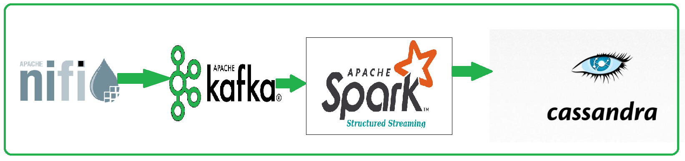
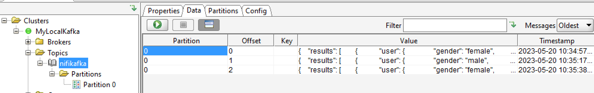
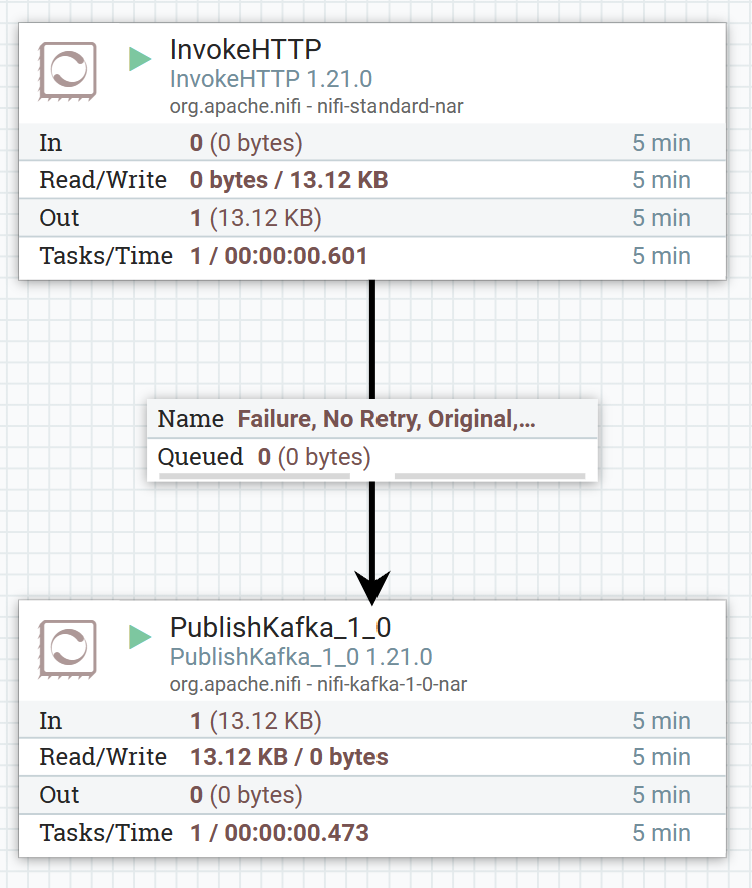
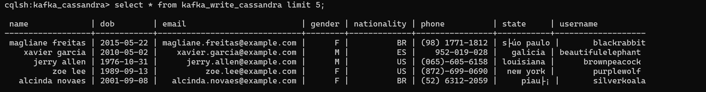

# Streaming Pipeline with NiFi, Kafka, Spark, and Cassandra

  

   

This README provides instructions for setting up and running a streaming pipeline that involves generating 
JSON data using NiFi's InvokeHTTP processor, ingesting it into Kafka using PublishKafka, 
and processing and transforming the data with Spark (Scala) before writing it to a Cassandra table.

## Prerequisites
* Apache NiFi installed and configured.
* Apache Kafka installed and running.
* Apache Spark installed and configured (with Scala).
* Apache Cassandra installed and running.
  
## Setup
  Clone the repository and navigate to the project directory.
  Install the required dependencies:

## Configuration

### Execute the following command to create a kafka topic:

 `C:\kafka_33\bin\windows\kafka-topics.bat --create --bootstrap-server localhost:9092 --replication-factor 1 --partitions 1 --topic nifikafka`

  

 

### Open the NiFi UI and configure the following processors in NiFi:
  * InvokeHTTP: Set the appropriate URL and parameters to generate JSON data.
  *  PublishKafka: Provide the Kafka topic and connection details.    

  

     

 ExecuteSparkStreaming: Configure Spark (Scala) to subscribe to the Kafka topic and process the JSON data.

 ### Cassandra: Set the connection details and define the Cassandra table.
`CREATE KEYSPACE IF NOT EXISTS kafka_cassandra
WITH replication = {'class': 'SimpleStrategy', 'replication_factor': '1'}; `

`CREATE TABLE kafka_write_cassandra(
name text PRIMARY KEY,
username text,
dob date,
email text,
gender text,
state text,
phone text,
nationality text
);`

## Running the Streaming Pipeline

 * The streaming pipeline will generate JSON data using NiFi, ingest it into Kafka, and process it with Spark (Scala). 
 * Finally, the transformed data will be written to the specified Cassandra table.

  

  

